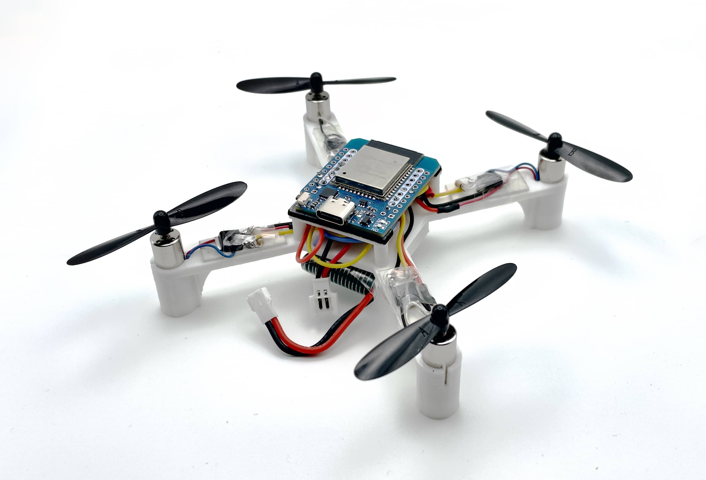

## 1. 机器人

|                             预览                             |                             项目                             |                           项目地址                           |
| :----------------------------------------------------------: | :----------------------------------------------------------: | :----------------------------------------------------------: |
|  |                          Quadruped                           | [github查看](https://github.com/stanfordroboticsclub/StanfordQuadruped) |
|  |                           OpenCat                            | [github查看](https://github.com/PetoiCamp/OpenCat-Quadruped-Robot) |
|  |                         AmazingHand                          | [gihub 查看](https://github.com/pollen-robotics/AmazingHand) |
|  |                            LeLamp                            |   [gihub 查看](https://github.com/humancomputerlab/LeLamp)   |
|  |                      ESP-ROLL球形机器人                      | [gitHub 查看](https://www.elektormagazine.com/labs/esp-roll-build-a-spherical-self-balancing-robot-with-esp32-camera) |
|  |                           miniKame                           |     [gitHub 查看](https://github.com/JavierIH/miniKame)      |
|  |                            iOlly                             |        [gitee 查看](https://gitee.com/kabumos/iOlly)         |
|  |                          六足机器人                          | [gitee 查看](https://gitee.com/Brend0/hexapod-robot) [B站查看](https://www.bilibili.com/video/BV15x4y1N7id/?pop_share=1&vd_source=1608f0247af63a025b4aed15bc542838) |
|  |                    Vorpal 教育六足机器人                     | [Vorpal](https://vorpalrobotics.com/) [打印件](https://www.thingiverse.com/thing:2513566) |
|  |                          轮腿机器人                          |   [LeTian-robot2](https://oshwhub.com/z.sir/letian-robot2)   |
|  |                        手机六足机器人                        |      [hexapod](https://github.com/MakeYourPet/hexapod)       |
|  |                          四足机器人                          |        [hexapod](https://gitee.com/kabumos/quadruped)        |
|  |             基于NVIDIA Jetson Nano的教育AI机器人             |      [jetbot](https://github.com/NVIDIA-AI-IOT/jetbot)       |
|  |                        ElectronBot                         | [桌面级小机器工具人](https://github.com/peng-zhihui/ElectronBot)  [语音版](https://github.com/jinsonli/ElectronBot-Voice) |
|                    超迷你机械臂机器人项目                    |   视频介绍：[【自制】我造了一台 钢 铁 侠 的 机 械 臂 ！【硬核】](https://www.bilibili.com/video/BV12341117rG) |   [GitHub](https://github.com/peng-zhihui/Dummy-Robot)     |
|                       MiniRover火星车                        |                    自制火星车的开源资料。                    |   [GitHub](https://github.com/peng-zhihui/MiniRover-Hardware) |                
|                  X-Bot智能机械臂写字机器人                   |                   基于CoreXY结构的机械臂。                   |        [GitHub](https://github.com/HogwartsRico/X-Bot)        |                
|                     ONE-Robot独轮机器人                      |               基于IMU和STM32的独轮自平衡机器人。              |   [GitHub](https://github.com/peng-zhihui/ONE-Robot)      |            
|                  基于树莓派的目标识别与追踪                  |            基于树莓派 + Web Camera的视觉追踪项目。            |   [GitHub](https://github.com/automaticdai/rpi-object-detection) |       
|                  ElectronBot迷你桌面机器人                   |                    非常小巧的桌面机器人。                    |       [项目主页](https://github.com/peng-zhihui/ElectronBot)    |           
|                           vlm_arm                            |                     机械臂+大模型+多模态                     |        [GitHub](https://github.com/TommyZihao/vlm_arm)         |      
|                  awesome-3dcv-papers-daily                   | 主要记录计算机视觉、VSLAM、点云、结构光、机械臂抓取、三维重建、深度学习、自动驾驶等前沿paper与文章。 |  [GitHub](https://github.com/qxiaofan/awesome-3dcv-papers-daily) | 
|                      宇树科技四足机器人                      |    宇树科技四足机器人Go1/Go2的ROS驱动包。            | [GitHub](https://github.com/unitreerobotics/unitree_ros)   |           
|                  小米CyberDog开源四足机器人                  |   小米CyberDog四足机器人的开源软件和硬件资料。         | [GitHub](https://github.com/MiRoboticsLab/cyberdog_ros2)   |        
|                 浙江大学FAST实验室无人机项目                 |           250mm自主无人机的硬件和软件设计。               | [GitHub](https://github.com/ZJU-FAST-Lab/Fast-Drone-250)   |      
|                  香港科技大学空中机器人项目                  |         空中机器人在线运动规划的快速增量欧几里得距离场。       | [GitHub](https://github.com/HKUST-Aerial-Robotics/FIESTA)   | 
|                  |         DIY智能手表Monica                         |   [GitHub](https://github.com/Forairaaaaa/Monica)             |             
|                     |        树莓派 AMOLED 屏幕小电脑                    |  [GitHub](https://github.com/Forairaaaaa/Rebecca)            |                 
|            |                         模块化智能镜面，把镜子变成智能助手          |   [GitHub](https://github.com/MagicMirrorOrg/MagicMirror) [安装手册](https://docs.magicmirror.builders/getting-started/installation.html) [组件列表](https://modules.magicmirror.builders/)             |
|                |          基于 ESP32 的四轴飞行器          |    [GitHub](https://github.com/okalachev/flix)              |         
|                      |          lyfPrinter热敏打印机             |    [项目主页](https://oshwhub.com/lengyuefeng/re-min-da-yin-ji-stm32_-li-dian-chi-gong-dian-v1-0) |  
|               |         ESP32-C3——AI对话机器狗            |  [立创](https://oshwhub.com/esp-college/esp-hi) [Gitee查看 ](https://oshwhub.com/esp-college/esp-hi)|  
## 2. 电子设计项目 

|              项目名称               |                           项目地址                           |                           项目介绍                           |
| :---------------------------------: | :----------------------------------------------------------: | :----------------------------------------------------------: |
| PocketLCD: 带充电宝功能的便携显示器 |      [GitHub](https://github.com/peng-zhihui/PocketLCD)      | 介绍视频：[【自制】你的下一个显示器，可能是个充电宝？？](https://www.bilibili.com/video/BV17D4y1X7AT) |
|     L-ink电子墨水屏NFC智能卡片      |     [GitHub](https://github.com/peng-zhihui/L-ink_Card)      | 为了解决个人使用IC卡时遇到的一些痛点设计的一个迷你NFC智能卡片，基于STM32L051和ST25DV。 |
|  低成本激光投射虚拟键盘的设计制作   |                                                              | - [低成本激光投射虚拟键盘的设计制作-上(原理和硬件)](http://www.csksoft.net/blog/post/lowcost.laserkbd_part1.html)  - [低成本激光投射虚拟键盘的设计制作-下(算法与实现)](http://www.csksoft.net/blog/post/lowcost.laserkbd_part2.html) |
|     自制低成本3D激光扫描测距仪      | [Google Code](https://code.google.com/archive/p/rp-3d-scanner/) | - [自制低成本3D激光扫描测距仪(3D激光雷达)，第一部分](http://www.csksoft.net/blog/post/lowcost_3d_laser_ranger_1.html)  - [自制低成本3D激光扫描测距仪(3D激光雷达)，第二部分](http://www.csksoft.net/blog/post/lowcost_3d_laser_ranger_2.html) |
|        NixieClock辉光管时钟         |       [GitHub](https://github.com/blanboom/NixieClock)       |                 支持蓝牙 4.0 的辉光管时钟。                  |
|            Gameduino 2/3            | [Gameduino 2 (KS)](https://www.kickstarter.com/projects/2084212109/gameduino-2-this-time-its-personal?ref=discovery&term=Gameduino) \| [Gameduino 3 (KS)](https://www.kickstarter.com/projects/2084212109/gameduino-3?ref=discovery&term=Gameduino) | Gameduino是基于Arduino的图形交互和游戏扩展版。它是目前Arduino平台上性能最好的图形协处理器。它由ExCamera在Kickstarter上成功众筹。云飞实验室参与了工具链开发、中文手册 [(点击这里下载)](http://excamera.com/files/gd2book_cn.pdf) 以及中文推广。 |
|       妖姬 – 增强现实电子植物       |   [GitHub](https://github.com/automaticdai/arduino-yaoji)    | 妖姬是云飞实验室在极客大赛中的48小时极限创作作品。妖姬是一款概念式的互动电子植物，采用了Arduino + Android的方案，融合了信息与物理的概念式作品。 |
|            YF Smart Home            |     [GitHub](https://github.com/yfrobotics/yf-home-iot)      |      云飞智能家居项目旨在探索新的智能家居系统解决方案。      |
|         树莓派温湿度气象站          | [GitHub](https://github.com/automaticdai/rpi-environmental-sensing) |                基于树莓派的开源温湿度气象站。                |
|         ESP32智能家居开发板         |        [GitHub](https://github.com/espressif/esp-idf)        |           ESP32系列芯片的官方开发框架和示例项目。            |
|         LicheeRV开发板项目          |   [GitHub](https://github.com/sipeed/LicheeRV-Nano-Build)    |             LicheeRV-Nano的构建项目和开发工具。              |

## 3. 处理器架构及操作系统

|          项目名称           |                       项目地址                       |                           项目介绍                           |
| :-------------------------: | :--------------------------------------------------: | :----------------------------------------------------------: |
| 香山（XiangShan）开源处理器 | [GitHub](https://github.com/OpenXiangShan/XiangShan) |            香山是一款开源的高性能 RISC-V 处理器。            |
|          RT-Thread          |   [GitHub](https://github.com/RT-Thread/rt-thread)   | RT-Thread诞生于2006年，是一款以开源、中立、社区化发展起来的物联网操作系统。 |
|       TencentOS Tiny        | [GitHub](https://github.com/Tencent/TencentOS-tiny)  | 腾讯物联网终端操作系统（TencentOS tiny）是腾讯面向物联网领域开发的实时操作系统，具有低功耗，低资源占用，模块化，安全可靠等特点，可有效提升物联网终端产品开发效率。TencentOS tiny 提供精简的 RTOS 内核，内核组件可裁剪可配置，可快速移植到多种主流 MCU 及模组芯片上。而且，基于RTOS内核提供了丰富的物联网组件，内部集成主流物联网协议栈（如 CoAP/MQTT/TLS/DTLS/LoRaWAN/NB-IoT 等），可助力物联网终端设备及业务快速接入腾讯云物联网平台。 |
|            AimRT            |     [GitHub](https://github.com/AimRT/AimRT)           | AimRT 是现代机器人领域的基本运行时框架。它基于现代C++开发，轻量级且易于部署，在资源管控、异步编程、部署配置等方面具有较为现代化的设计。AimRT致力于整合机器人端侧、边缘端、云端等多种部署场景的研发。它服务于现代人工智能和基于云的机器人应用，并提供现代和完整的调试和性能分析工具，以及良好的可观测性支持。AimRT还提供了全面的插件开发接口，具有高度的扩展性，兼容ROS2、HTTP、Grpc等传统机器人生态系统或云服务生态系统，支持您现有系统的逐步升级。   |    

## 4. 机器学习项目 

|   项目名称   |                           项目地址                           |                           项目介绍                           |
| :----------: | :----------------------------------------------------------: | :----------------------------------------------------------: |
|   DeepSeek   | [DeepSeek-V3](https://github.com/deepseek-ai/DeepSeek-V3) \| [DeepSeek-R1](https://github.com/deepseek-ai/DeepSeek-R1) | DeepSeek 模型是近年来在自然语言处理（NLP）领域备受瞩目的开源大规模语言模型系列。其最新版本 DeepSeek-V3 采用了混合专家（Mixture-of-Experts，MoE）架构，拥有 6710 亿个参数，每个词元（token）激活 370 亿个参数。该模型在多项基准测试中表现出色，性能媲美 GPT-4 和 Claude 等领先的闭源模型。 |
|     TVM      |           [GitHub](https://github.com/apache/tvm)            | *Apache TVM* 是一个用于CPU、GPU 和机器学习加速器的开源机器学习编译器框架，旨在让机器学习工程师能够在任何硬件后端上高效地优化和运行计算。 |
|    MxNet     |     [GitHub](https://github.com/apache/incubator-mxnet)      |             深度学习编程框架，支持C++/Python/R。             |
|    Caffe2    |     [GitHub](https://github.com/facebookarchive/caffe2)      | 深度学习编程框架，支持C++/Python/Matlab。现已与Pytorch合并。 |
| PaddlePaddle |       [GitHub](https://github.com/PaddlePaddle/Paddle)       | 飞桨（PaddlePaddle）以百度多年的深度学习技术研究和业务应用为基础，集深度学习核心训练和推理框架、基础模型库、端到端开发套件、丰富的工具组件于一体，是中国首个自主研发、功能丰富、开源开放的产业级深度学习平台。 |
|  DeepVision  |     [GitHub](https://github.com/peng-zhihui/DeepVision)      | 本项目实现了移动端CV算法快速验证框架，旨在提供一套通用的CV算法验证框架。框架经过本人一年多的开发和维护，目前已经完成绝大部分API的开发，实现包括实时视频流模块、单帧图像处理模块、3D场景模块、云端推理模块等众多功能。 |
| MMDetection  |     [GitHub](https://github.com/open-mmlab/mmdetection)      |                商汤的目标检测工具箱及基准测试                |
|   ChatGLM    |        [GitHub](https://github.com/THUDM/ChatGLM-6B)         |            开源双语对话语言模型，支持中英文对话。            |
|     Qwen     |           [GitHub](https://github.com/QwenLM/Qwen)           |                阿里云通义千问大语言模型系列。                |
|   Baichuan   |     [GitHub](https://github.com/baichuan-inc/Baichuan2)      |                   百川智能开源大语言模型。                   |
|   InternLM   |        [GitHub](https://github.com/InternLM/InternLM)        |                上海AI实验室开源的大语言模型。                |

## 5. 有趣的 3D 打印件

|                             预览                             |        项目        |                           项目地址                           |
| :----------------------------------------------------------: | :----------------: | :----------------------------------------------------------: |
|  | 戒指盒 Kinetic Box | [P站下载](https://www.printables.com/model/132695-kinetic-ring-box) |
